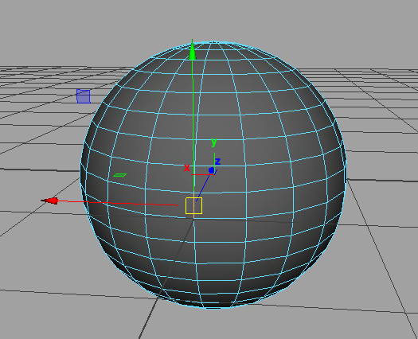
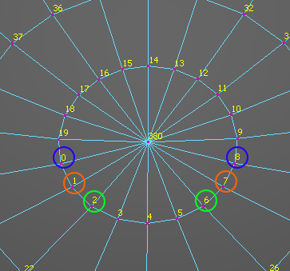
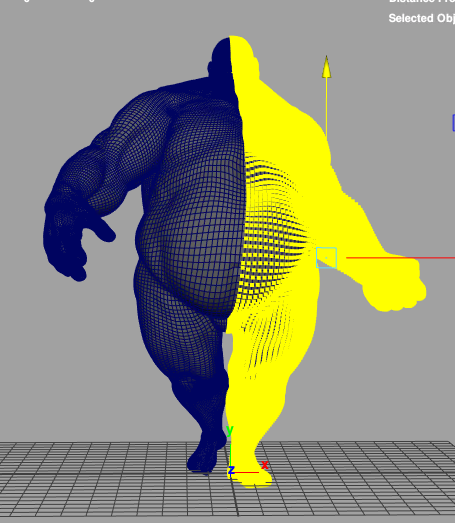
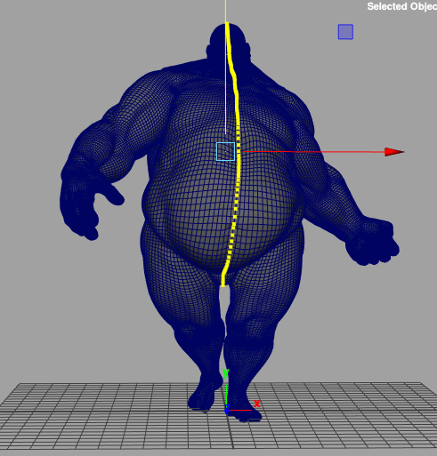

# symmetryTable

Maya plugin to find corresponding symmetrical vertices, edges, or faces based on topological symmetry table.

**This is a plugin that only creates symmetry tables and does not include any tools such as mirroring vertex positions/weights.**

## Build
for Maya2022 linux/macOS

```
> mkdir build
> cd build
> cmake -G "Unix Makefiles" -DCMAKE_BUILD_TYPE=Release -DMAYA_ROOT_DIR="path/to/maya/dir" -DMAYA_VERSION=2022 ../
> cmake --build . --config Release --target install
```

Windows
```
>
```

## How to use
Select the edge located in the center of the topology and run the command.


## Flags
| Long name(short name) | Argument types | Default | Description |
|:---------|:--------------:|:-------:|:----------:|
|vertex ( v )|boolean|true|Return vertex indices|
|edge ( e )|boolean|false|Return edge indices|
|face ( f )|boolean|false|Return face indices|
|half ( hf )|boolean|false|Return only vertices one side.|
|verbose ( vb )|boolean|false|Verbose outputs|

## Example
```python
from maya import cmds
vtxs = cmds.createSymmetryTable()
print(vtxs)
> [8L, 7L, 6L, 5L, 4L, 3L, 2L, 1L, 0L, 19L, 18L, 17L, 16L, ... ]
 #, where the corresponding vertex of the first vertex is 8, the second vertex is 7, the third is 6, and so on...

```


### Select only left/right side of vertices
```python
vtxs = cmds.createSymmetryTable(half=True)  # Make sure half flag is on

# Extract only one side
# In this case, key of dict is left, value is right
numVert = len(vtxs)
d = {n: int(vtxs[n]) for n in range(numVert) if vtxs[n] != -1}

# Select object
sel = cmds.ls(sl=True, fl=True, long=True)[0]
paths = ["{}.vtx[{}]".format(sel, i) for i in d]
cmds.select(paths, r=True)
```


### Select only the middle vertices
```python
vtxs = cmds.createSymmetryTable()

# Extract only middle vertices
d = [i for n, i in enumerate(vtxs) if n == vtxs[n]]

# Select object
sel = cmds.ls(sl=True, fl=True, long=True)[0]
paths = ["{}.vtx[{}]".format(sel, i) for i in d]
cmds.select(paths, r=True)
```
